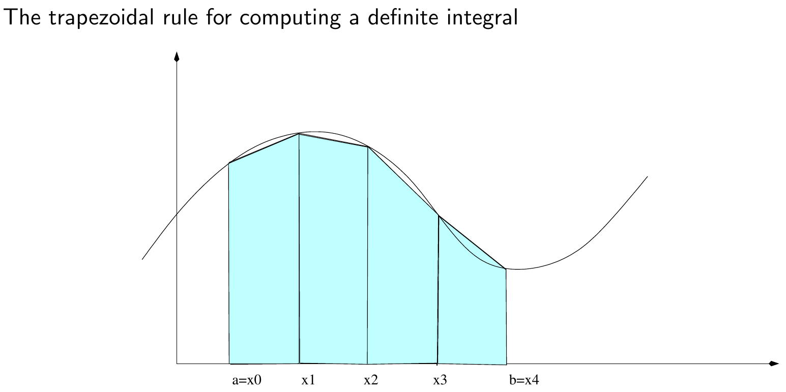

# Integral Computation using trapezoidal rule
This is a folder containing some example of an integral computation using the trapezoidal rule. \
In particular, in this project, it will be used MPI for multi-process parallelization of the computation. \
\
\
This is a visual example of the computation we are achieving:

This is the formula used to compute the integral:

$\int_{a}^{b}f(x)dx = \sum_{i=1}^{n}{\frac{1}{2}h[f(x_i)+f(x_{i-1}))]} = h \cdot \{ \frac{f(x_0)}{2} + \frac{f(x_1)}{2} + \sum_{i=1}^{n-1}{f(x_i)}  \}$
\
\
Compile using make normal or make parallel to compare time results. \
Run using mpirun -n <# of processes> ./integral \
 